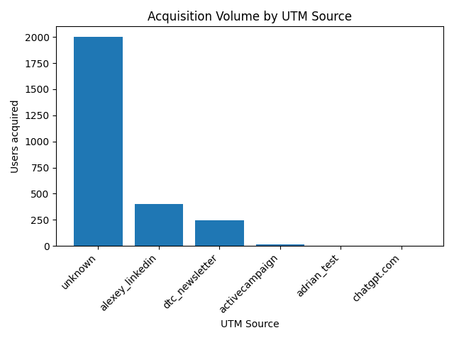
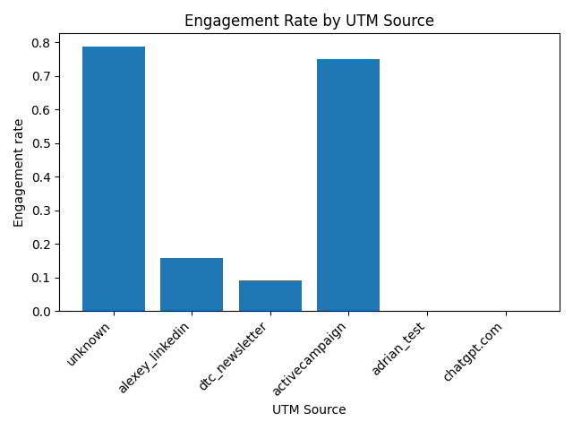
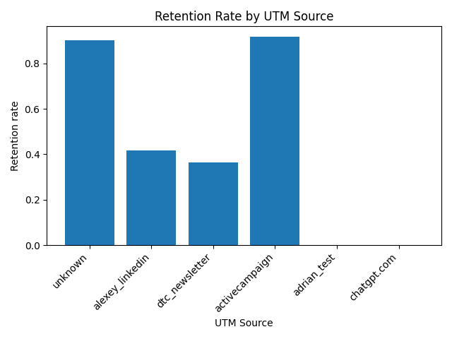

# UTM Attribution Funnel

Analyze which acquisition sources (`utm_source`) bring **high-quality users** who engage and retain.

---

## How to Run

1) Install dependencies
```bash
pip install -r requirements.txt
```

2) Run the pipeline
```bash
python main.py
```
This will automatically:

- Clean and preprocess the raw CSV
- Build contact, UTM, and event tables
- Roll up user-level engagement metrics
- Compute per-source KPIs (acquisition, engagement, retention)
- Save CSVs and charts inside the outputs/ folder

- Create a DuckDB database at outputs/duckdb/attribution.duckdb. This DuckDB file contains all processed tables (contacts, utm, events, users, metrics, cat_mix) so you can query the entire data model directly using SQL.

---

## Key Outputs

### 1) Acquisition Volume by UTM Source


- The largest bucket is **`unknown`** (around 2000 users).  
  - This is a serious attribution gap. Most of our traffic sources are not being captured.  
  - Since these users are highly engaged and retained, identifying their true source is critical.  
- **`alexey_linkedin`**: around 400 users.  
- **`dtc_newsletter`**: around 250 users.  
- Other channels (`activecampaign`, `adrian_test`, `chatgpt.com`) have negligible traffic.

**Interpretation:** LinkedIn and newsletter are real acquisition sources, but without fixing attribution, most of our acquisition volume is effectively invisible.

### 2) Engagement Rate by UTM Source


- **`unknown`** users: around 78% engaged → very high.  
- **`activecampaign`**: around 75% engaged (excellent), though tiny volume.  
- **`alexey_linkedin`**: around 15% engaged (low).  
- **`dtc_newsletter`**: around 9% engaged (very low).  
- Other minor sources are close to zero.  

**Interpretation:** LinkedIn and newsletter bring users, but they don’t activate well. Users from these sources sign up but rarely take meaningful actions afterward.

### 3) Retention Rate by UTM Source


- **`unknown`**: around 90% retained (extremely strong).  
- **`activecampaign`**: around 91% retained (also strong, but tiny volume).  
- **`alexey_linkedin`**: around 40% retained.  
- **`dtc_newsletter`**: around 36% retained.  
- Other sources show negligible retention.  

**Interpretation:** Users from `unknown` and `activecampaign` don’t just engage once. They stick around. By contrast, LinkedIn and newsletter users mostly churn after initial signup.

CSV results are also saved to `outputs/`:
- `per_utm_metrics.csv`: acquisition, engagement, retention by source
- `users_table.csv`: per-user rollup with funnel flags
- `event_category_mix.csv`: distribution of event categories per source

---

## Business Takeaways

- Clarify unknown sources: A large number of users come from an “unknown” category. If we can identify where these users actually come from, we’ll get a much clearer picture of which marketing channels are truly driving growth.

- Improve post-signup engagement: Channels like alexey_linkedin and dtc_newsletter are good at attracting signups, but users from these sources don’t stay very active afterward We should focus on improving onboarding and engagement for these new users.

- Scale high-quality channels: The activecampaign source brings fewer users, but they are more engaged and tend to stick around. It would be worth exploring how to attract more users like these or invest more in similar channels.

---
